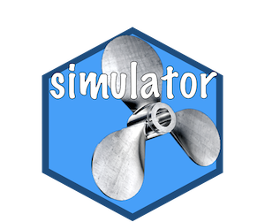

<!-- README.md is generated from README.Rmd. Please edit this file -->

# The Simulator 

The [simulator](https://jacobbien.github.io/simulator/) is an R package
that streamlines the process of performing simulations by creating a
common infrastructure that can be easily used and reused across
projects. The paper [The Simulator: An Engine to Streamline
Simulations](https://arxiv.org/abs/1607.00021) discusses the simulator
in greater depth.

## Installation

The most up-to-date version of the simulator is on this github page and
can be installed using the
[devtools](https://cran.r-project.org/package=devtools) R package (if
not already installed, open R and type `install.packages("devtools")`).
To install simulator, type

``` r
devtools::install_github("jacobbien/simulator")
```

in R. This installs `simulator` from github.

## Vignettes

The [Getting
Started](https://jacobbien.github.io/simulator/articles/simulator.html)
vignette walks you through setting up your first simulation with the
simulator.

The best way to get a sense of how to use the simulator is to look at
examples. There are several vignettes that demonstrate how the simulator
can be used to conduct simulations for some of the most famous
statistical methods.

1)  [Lasso](https://jacobbien.github.io/simulator/articles/lasso.html)
    vignette: Explains basics, including the magrittr pipe and making
    plots and tables. Also demonstrates some more advanced features such
    as writing method extensions (such as refitting the result of the
    lasso or performing cross-validation).
2)  [James-Stein](https://jacobbien.github.io/simulator/articles/james-stein.html)
    vignette: Shows how to step into specific parts of the simulation
    for troubleshooting your code.
3)  [Elastic
    net](https://jacobbien.github.io/simulator/articles/elastic-net.html)
    vignette: Shows how we can work with a sequence of methods that are
    identical except for a parameter that varies
4)  [Benjamini-Hochberg](https://jacobbien.github.io/simulator/articles/fdr.html)
    vignette: Shows how we can load a preexisting simulation and add
    more random draws without having to rerun anything. It also shows
    how one can have multiple simulation objects that point to
    overlapping sets of results.
